# adaptive-rag-agent — Adaptive RAG workflow

Routes each question by complexity, **before any retrieval happens**, to one of three branches:
answer directly, run [corrective-rag-agent](../corrective-rag-agent/README.md)'s whole graph, or
run [query-decomposition-agent](../query-decomposition-agent/README.md)'s whole graph. See
[docs/patterns/rag/adaptive-rag.md](../../../docs/patterns/rag/adaptive-rag.md) for the full
writeup.



**Reach for this when:** you have a genuinely heterogeneous mix of questions — some answerable
from general knowledge, some needing one lookup, some needing several independent lookups — and
you're willing to accept real routing complexity/cost to handle all three well. Per
[docs/patterns/rag/adoption-strategy.md](../../../docs/patterns/rag/adoption-strategy.md), this is
the sole pattern in "Agentic RAG," reached for last, not because it's "the most advanced" but
because it's the right answer to a specific diagnosed symptom (a heterogeneous query mix).

## Two deliberate deviations from the doc

**Implements the Advanced 3-way router directly, skipping the Beginner binary design.** The doc's
Beginner design routes binary (`vectorstore` vs `web_search`) into a shared graph. With web search
removed repo-wide (see corrective-rag-agent's README), a binary router missing one of its two
branches is degenerate — it would always pick `vectorstore`, i.e. just be corrective-rag-agent with
router overhead, demonstrating nothing new. So this skips straight to the Advanced complexity
router (`no_retrieval` / `single_step` / `multi_step`), since that's the version that actually
demonstrates a routing *decision*.

**Multi-step branch uses Query Decomposition, not Self-RAG** (the doc offers either). Stacking
[self-rag-agent](../self-rag-agent/README.md)'s own cyclic retry machinery underneath an
already-branching router risks a combinatorially confusing graph for a pattern whose whole point is
demonstrating routing cleanly. Query Decomposition's linear shape keeps this graph's complexity
focused on the one thing it's meant to teach.

## Stack

Raw LangGraph `StateGraph` with a **conditional entry point** (`route_by_complexity` runs first,
via `add_conditional_edges(START, ...)`), not a conditional edge after some fixed first node —
this is the one pattern in the RAG series where the very first thing that happens is a decision.

This is the pattern with the **most duplicated code** in the whole series: the `single_step`
branch duplicates corrective-rag-agent's retrieve/grade/retry-or-generate nodes; the `multi_step`
branch duplicates query-decomposition-agent's decompose/answer/synthesize nodes. Accepted
tradeoff, per this repo's convention (see corrective-rag-agent's README) — a reader of this
graph shouldn't need to open two other packages to understand what `single_step`/`multi_step`
actually do.

## Graph shape

- **`route_by_complexity`** (conditional entry point) — one structured-output LLM call
  (`ComplexityRoute`) classifying the question, routing to:
  - **`generate_direct`** — no retrieval at all, straight `model.invoke(question)` → `END`.
  - **`retrieve`** / **`grade_documents`** / **`decide_to_generate`** / **`transform_query`** /
    **`generate`** — corrective-rag-agent's retrieval-retry loop, verbatim shape.
  - **`decompose`** / **`answer_sub_questions`** / **`synthesize`** —
    query-decomposition-agent's decompose/answer/synthesize shape, verbatim.

`build_rag_graph`'s `retriever=`/`prompts=` parameters mirror the other RAG patterns' injection
points for hermetic tests.

## Running it

```bash
make up
uv run adaptive-rag-agent "What framework tier does react-agent use?"
```

## Tests

```bash
make test-unit          # tests/unit — no external services; one test per branch, each asserting
                         # it never touches nodes/dependencies belonging to the other branches
make up
make test-integration   # tests/integration — real Postgres + real Milvus retrieval (single_step
                         # branch, forced via a fake router), grading/generation faked
make provision-datasets
make test-eval           # tests/evals — real model + real Milvus, two guideline judges, dataset
                         # spans all three complexity tiers
```

- `tests/unit/test_graph.py` — one test per branch (`no_retrieval`, `single_step`, `multi_step`),
  each asserting the right terminal answer and that irrelevant dependencies (retriever, grader,
  decomposer) were never called — e.g. `no_retrieval` must never call the retriever at all.
- `tests/integration/test_checkpointing.py` — asserts state survives a checkpointer rebuild for
  the single_step branch, real Milvus retrieval, routing/grading/generation faked.
- `tests/evals/test_quality.py` — scores both `grounded_in_context` and `routed_appropriately`
  (router miscalibration is this pattern's headline risk) against a dataset deliberately spanning
  all three complexity tiers.
