# corrective-rag-agent — Corrective RAG (CRAG) workflow

Grades each retrieved chunk for relevance before trusting it, and retries retrieval with a
rewritten question if none of them are relevant. See
[docs/patterns/rag/corrective-rag-crag.md](../../../docs/patterns/rag/corrective-rag-crag.md) for
the full writeup.



**Reach for this when:** [basic-rag-agent](../basic-rag-agent/README.md)/
[retrieve-rerank-agent](../retrieve-rerank-agent/README.md) are retrieving genuinely irrelevant
chunks — not just imperfectly ranked ones — and generation is hallucinating as a result. Per
[docs/patterns/rag/adoption-strategy.md](../../../docs/patterns/rag/adoption-strategy.md), this is
"Hybrid RAG" — a real control-flow addition, not just a precision tweak.

Implements the doc's **Beginner** design (binary relevance gate) only. The **Advanced** 3-tier
confidence router (correct/incorrect/ambiguous, with strip-level re-grading) is an intentional
non-goal — adopt the failure you've actually diagnosed, don't stack speculative sophistication.

## Stack

Raw LangGraph `StateGraph`, genuinely stateful with conditional branching this time (contrast
basic-rag-agent's/retrieve-rerank-agent's straight-line graphs).

**No web search.** The reference design falls back to an external web search (Tavily) when
retrieved documents are graded insufficient. This repo has a strict one-credential
(`MLFLOW_TRACKING_TOKEN`) rule — no room for a second, unrelated API key — so that branch is
replaced with **retry retrieval against the same Milvus collection with a rewritten question**
instead (`transform_query` loops back into `retrieve`). Looping back into `retrieve` risks looping
forever if the rewrite is still graded poorly, so a `retry_count` cap (`MAX_RETRIES = 2`) forces
the graph to `generate` anyway once exhausted — a logged, honest best-effort rather than an
infinite loop.

Reuses `basic-rag-agent`'s Milvus collection (`COLLECTION_NAME`) and embeddings route. Per this
repo's convention, node functions are **duplicated**, not imported, from `basic-rag-agent` — this
graph is meant to be readable standalone. `self-rag-agent` and `adaptive-rag-agent` (built after
this pattern) duplicate *this* graph's shape in turn, for the same reason.

## Graph shape

1. **`retrieve`** — same Milvus retrieval as basic-rag-agent.
2. **`grade_documents`** — one structured-output LLM call per retrieved chunk (`DocumentGrade`,
   binary `yes`/`no`), filtering to only the chunks graded relevant. Sets
   `documents_sufficient = len(relevant) > 0`.
3. **`decide_to_generate`** (conditional edge) — sufficient → `generate`; insufficient and under
   the retry cap → `transform_query`; insufficient and cap reached → `generate` anyway (the
   infinite-loop guard, logged via `corrective_rag_retry_cap_reached`).
4. **`transform_query`** — rewrites the question (preserving `original_question` untouched),
   increments `retry_count`, loops back to `retrieve`.
5. **`generate`** — same shape as basic-rag-agent's, answering from `original_question` against
   whatever `documents` survived grading.

`build_rag_graph`'s `retriever=`/`prompts=` parameters mirror basic-rag-agent's injection points
for hermetic tests.

## Running it

```bash
make up
uv run corrective-rag-agent "What framework tier does react-agent use?"
```

## Tests

```bash
make test-unit          # tests/unit — no external services; retriever and model (grading,
                         # rewriting, generation) all stubbed
make up
make test-integration   # tests/integration — real Postgres + real Milvus retrieval, grading
                         # always passes (fake), so the retry loop isn't exercised here
make provision-datasets
make test-eval           # tests/evals — real model + real Milvus, grounded_in_context
```

- `tests/unit/test_graph.py` — covers all-relevant (no retry), some-irrelevant-with-retry (loops
  once then succeeds), and retry-cap-reached (generates anyway, proving the graph never loops
  forever).
- `tests/integration/test_checkpointing.py` — asserts retrieval/answer state survives a rebuild of
  the compiled graph against real Postgres, real Milvus retrieval, fake grading/chat model.
- `tests/evals/test_quality.py` — MLflow GenAI eval suite scoring `grounded_in_context` against
  `packages/mlflow-server/datasets/corrective-rag-agent.jsonl`.
