# evaluator-optimizer-agent — Evaluator-Optimizer workflow

One LLM generates a response while another evaluates it and provides feedback, in a loop — the
same iterative process a human writer goes through drafting, getting feedback, and revising until
the piece is polished. See
[docs/patterns/agent/evaluator-optimizer.md](../../../docs/patterns/agent/evaluator-optimizer.md)
for the full writeup.



**Reach for this when:** there are clear evaluation criteria and iterative refinement provides
measurable value — specifically when LLM responses can be demonstrably improved by feedback, and
the LLM can meaningfully provide that feedback on its own output. If neither holds, this pattern
just adds latency and cost for no measurable gain.

## Stack

Raw LangGraph `StateGraph`, same as
[`orchestrator-workers-agent`](../orchestrator-workers-agent/README.md) — there's no tool loop
here for `langchain.agents.create_agent` to compile; the loop is a generate/evaluate cycle, not
model-driven tool calls. Distinct from Self-Refine (not implemented in this repo): two separate
LLM calls in different roles — a generator and an evaluator — rather than one model critiquing its
own output. Same `agents-common` checkpointing/observability/config wiring as `react-agent` and
`orchestrator-workers-agent`.

## Graph shape

1. **`generate`** — writes (or revises) a response to the task. On the first pass, `feedback` is
   empty; on every pass after that, the prompt includes the previous evaluation's `feedback` so
   the revision actually addresses it, not just restates the original.
2. **`evaluate`** — one LLM call with structured output (`Evaluation`: an `approved` bool plus a
   `feedback` string) checks the response against the task's `criteria`.
3. **A conditional edge** off `evaluate` (`route_after_evaluate`) exits the loop — to `END` — on
   either of two conditions: `approved=True`, or `iteration >= max_iterations` (default 3, set at
   graph-build time). Otherwise it loops back to `generate`. The loop is never unbounded, mirroring
   evaluator-optimizer.md's own `for _ in range(max_iterations)` example, just expressed as a
   LangGraph conditional edge instead of a Python loop.

## Running it

```bash
make up   # starts Postgres + MLflow + provisions the prompts/dataset/gateway route
uv run evaluator-optimizer-agent "Write a one-sentence tagline for a coffee shop." \
    "Exactly one sentence, no more than 12 words. Must mention coffee."
```

Prints whether the loop's own evaluator approved the response (or hit the iteration cap first),
how many iterations it took, and the final response.

## Tests

```bash
make test-unit          # tests/unit — no external services; model is stubbed
make up
make test-integration   # tests/integration — real Postgres, checkpoint round-tripping
make provision-datasets
make test-eval          # tests/evals — calls a real model via the MLflow AI Gateway
```

- `tests/unit/test_graph.py` — asserts the loop exits immediately on first approval, that a
  rejected response's feedback actually threads into the next `generate` call (and not before),
  and that the loop stops at `max_iterations` without ever approving, all against a stubbed model
  (monkeypatches `get_chat_model`).
- `tests/integration/test_checkpointing.py` — asserts the loop-carried `iteration`/`approved`
  state survives a rebuild of the compiled graph against a real Postgres-backed checkpointer.
- `tests/evals/test_quality.py` — MLflow GenAI eval suite scoring whether the loop's own
  evaluator reaches approval within the iteration cap, against the seed dataset at
  `packages/mlflow-server/datasets/evaluator-optimizer-agent.jsonl`.
