# retrieve-rerank-agent — Retrieve & Rerank RAG workflow

Retrieves a wide candidate set of chunks from Milvus, narrows it with a cross-encoder reranker,
then hands the top few to the LLM as grounding context. See
[docs/patterns/rag/retrieve-rerank.md](../../../docs/patterns/rag/retrieve-rerank.md) for the full
writeup.



**Reach for this when:** [basic-rag-agent](../basic-rag-agent/README.md) is retrieving mostly
relevant chunks but precision within that top-k is the problem — the right chunks are somewhere in
a wider candidate set but not reliably in the first few by embedding similarity alone. Per
[docs/patterns/rag/adoption-strategy.md](../../../docs/patterns/rag/adoption-strategy.md), this is
still "2-Step RAG" (same tier as Basic RAG) — a precision fix layered on retrieval, not a new
control-flow architecture. It cannot fix retrieval quality itself (irrelevant docs reaching the
candidate set at all) — that's [corrective-rag-agent](../corrective-rag-agent/README.md).

## Stack

Raw LangGraph `StateGraph`, same framing as every other pattern in this repo. The doc itself has no
LangGraph at all — it's a linear `retriever.invoke` → reranker → `llm.invoke` composition — but
this repo implements every pattern as a `StateGraph` for consistency (checkpointing/tracing per
node is worth having even without branching), matching `basic-rag-agent`'s own "workflow, not
agent" framing.

**A third, non-gateway model dependency.** Every other pattern's model access goes through the
MLflow AI Gateway (`get_chat_model`/`get_embeddings`). The reranker doesn't fit that: a
cross-encoder reranker isn't chat- or embeddings-shaped, so there's nothing in the gateway's
secret/model-definition/endpoint provisioning (`provision_gateway_route.py`) for it to plug into —
see `agents_common.models.get_reranker`'s docstring. Instead it's a plain, directly-configured HTTP
endpoint (`RERANKER_MODEL_BASE_URL`/`RERANKER_MODEL_API_KEY` in `.env`), same treatment
`MILVUS_URI` already gets. It speaks a vLLM/OpenAI-compatible rerank API (confirmed live, not
HuggingFace TEI as originally assumed): `POST /rerank` with `{"model", "query", "documents"}` →
`{"results": [{"index", "relevance_score", ...}], ...}`. `_parse_rerank_response` in
`agents_common/models/__init__.py` isolates the one place to fix it if the upstream shape ever
changes.

Reuses `basic-rag-agent`'s Milvus collection (`COLLECTION_NAME`) and embeddings route — this
pattern narrows what's already retrievable, it doesn't need a different corpus.

## Graph shape

1. **`retrieve`** — same Milvus retrieval as basic-rag-agent, but over-fetches (`k=20` by default,
   `DEFAULT_CANDIDATE_K`) rather than retrieving only the final handful — reranking needs a real
   candidate pool to narrow down; a too-small candidate set defeats the point.
2. **`rerank`** — calls `agents_common.models.get_reranker().rerank(question, candidates, top_n=5)`
   and reorders `candidate_chunks` into `reranked_chunks` by the reranker's own scores. Skips the
   HTTP call entirely on empty `candidate_chunks`.
3. **`generate`** — same shape as basic-rag-agent's, reading `reranked_chunks`; same empty-context
   → honest `NO_CONTEXT_ANSWER` branch.

`build_rag_graph`'s `retriever=`/`reranker=` parameters let tests inject fakes for both external
dependencies — unit tests fake both (no network at all); integration tests use a real retriever
against the seeded Milvus collection but a fake reranker (the reranker endpoint isn't
dockerized/local, so it's not something integration tests should depend on); only the eval suite
calls the real reranker HTTP endpoint.

## Running it

```bash
make up   # starts Postgres + MLflow + Milvus, provisions prompts/gateway routes/the collection
uv run retrieve-rerank-agent "What's the difference between supervisor and swarm/handoffs in this repo?"
```

Requires `RERANKER_MODEL_BASE_URL` set in `.env` and reachable.

## Tests

```bash
make test-unit          # tests/unit — no external services; retriever, reranker, and model all stubbed
make up
make test-integration   # tests/integration — real Postgres + real Milvus retrieval, fake reranker
make provision-datasets
make test-eval          # tests/evals — real model + real Milvus + real reranker HTTP call
```

- `tests/unit/test_graph.py` — pure graph-shape logic: reranker reorders/narrows candidates, empty
  retrieval short-circuits before ever calling the reranker or the model.
- `tests/integration/test_checkpointing.py` — asserts state survives a checkpointer rebuild, real
  retrieval against the seeded collection, fake reranker and chat model.
- `tests/evals/test_quality.py` — MLflow GenAI eval suite scoring `grounded_in_context` against
  `packages/mlflow-server/datasets/retrieve-rerank-agent.jsonl`, exercising the real reranker
  endpoint end-to-end.
