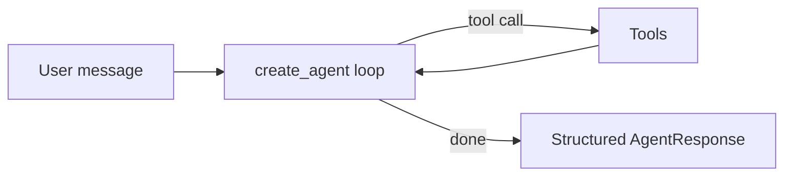

# react-agent — Tier 1: single ReAct agent

The reference implementation for the simplest pattern in this repo: one agent, a handful of
tools, a plain reason → act → observe loop, built with `langchain.agents.create_agent`. Every
other pattern in `agents/` (supervisor, swarm, deep agent) exists because a requirement pushed
past what this tier can express — see `docs/decisions/0001-tech-stack.md`.

## What it demonstrates

- `create_agent` with a `system_prompt`, typed tools, and a `response_format` for structured
  output (see `src/react_agent/graph.py`).
- Durable execution: the graph is compiled with a Postgres `checkpointer`, so a conversation
  (`thread_id`) survives process restarts — resume it and the agent picks up where it left off.
- Model access via the MLflow AI Gateway (`GATEWAY_ROUTE` in `src/react_agent/graph.py`) rather
  than a direct provider API key — see `agents_common.models.get_chat_model()`.
- MLflow tracing: every run is autologged (LLM calls, tool calls, latency, token usage) with
  zero manual instrumentation, into this agent's own experiment (`EXPERIMENT_NAME`), via
  `agents_common.observability.configure_mlflow()`.
- Three layers of tests: `tests/unit` (mocked model, no network), `tests/integration`
  (real Postgres checkpointer round-trip via docker compose), `tests/evals` (MLflow
  `mlflow.genai.evaluate()` suite against a live model).

## How it works

A single `create_agent` compiled to a LangGraph graph: reason, call a tool, observe, repeat
until it can answer — checkpointed to Postgres so a `thread_id` survives a process restart.



## Run it

```bash
# From the repo root, with the workspace synced (`uv sync`) and Postgres + MLflow running
# (`docker compose up postgres mlflow`):
cd agents/react-agent
cp ../../.env.example ../../.env   # fill in MLFLOW_TRACKING_TOKEN
uv run react-agent "What's 47 * 12, and then look up what that number means in dev slang?"
```

## Test it

```bash
uv run pytest -m unit                          # fast, no external services
uv run pytest -m integration                   # needs `docker compose up -d postgres mlflow`
uv run pytest -m eval                          # needs MLFLOW_TRACKING_TOKEN, costs tokens
```
